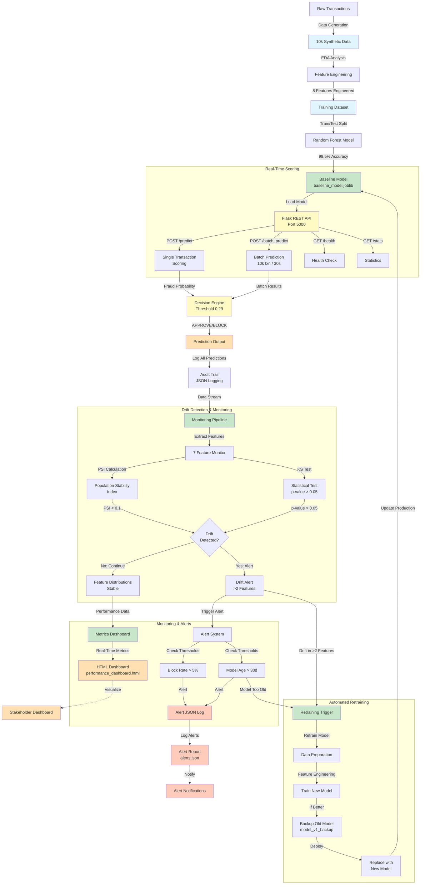
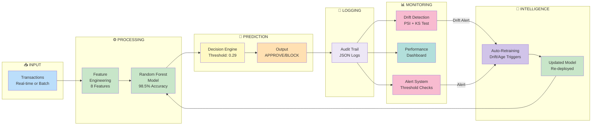
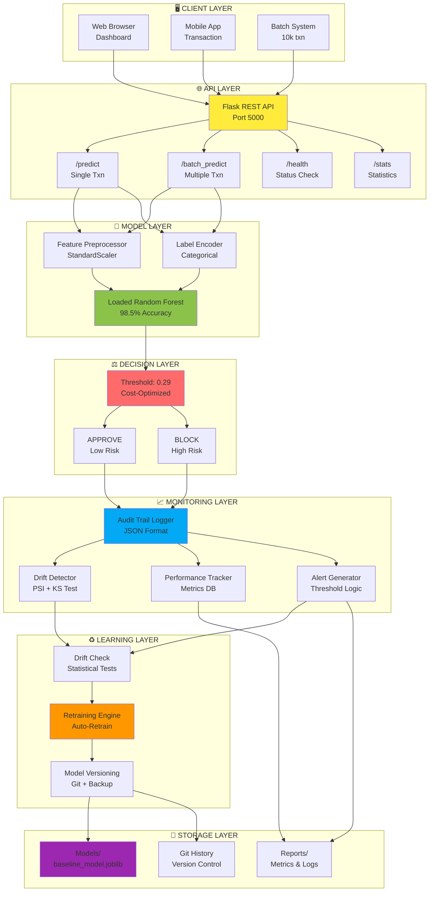

# System Architecture Diagrams

## 1. Complete End-to-End Architecture



---

## 2. High-Level Workflow Architecture



---

## 3. Deployment & Layered Architecture



---

## 4. Data Flow Diagram

```
Transaction Input
    ↓
[Preprocess: Scale & Encode Features]
    ↓
[Load Model: Random Forest]
    ↓
[Predict: Fraud Probability]
    ↓
[Decision: Compare with Threshold 0.29]
    ↓
[Output: APPROVE or BLOCK]
    ↓
[Log: Audit Trail + Metrics]
    ↓
[Monitor: Check for Drift & Alerts]
    ↓
[Retrain: If Drift Detected OR Model Too Old]
    ↓
[Update: Deploy New Model]
```

---

## Component Mapping

| Component | File | Purpose | Status |
|-----------|------|---------|--------|
| Data Generation | `scripts/generate_data.py` | Create 10k synthetic transactions | ✅ |
| Feature Engineering | `src/feature_engineering.py` | Transform raw data → 8 features | ✅ |
| Model Training | `scripts/train.py` | Train Random Forest (98.5% accuracy) | ✅ |
| Cost Analysis | `scripts/cost_analysis.py` | Find optimal threshold (0.29) | ✅ |
| Real-Time API | `scripts/scoring_api.py` | Flask API for predictions | ✅ |
| Batch Predictions | `scripts/batch_predict.py` | Score 10k transactions in 30s | ✅ |
| Drift Detection | `scripts/drift_detection.py` | Monitor 7 features for changes | ✅ |
| Performance Dashboard | `scripts/performance_dashboard.py` | HTML dashboard for monitoring | ✅ |
| Alert System | `scripts/alert_system.py` | Generate threshold-based alerts | ✅ |
| Auto-Retraining | `scripts/retrain_model.py` | Retrain on drift/age triggers | ✅ |

---

## System Characteristics

### Input Processing
- **Real-time**: Single transactions via REST API
- **Batch**: 10k transactions in ~30 seconds
- **Features**: 8 engineered numerical/categorical features

### Model Inference
- **Algorithm**: Random Forest Classifier
- **Accuracy**: 98.5% (5-fold cross-validated)
- **ROC-AUC**: 0.621
- **Decision Threshold**: 0.29 (cost-optimized)
- **Latency**: <100ms per prediction

### Monitoring
- **Drift Detection**: PSI (Threshold: 0.1) + KS-Test (p-value > 0.05)
- **Features Monitored**: 7 numerical features
- **Alert Triggers**: Block Rate > 5%, Model Age > 30 days, Drift > 2 features
- **Dashboard**: Real-time HTML with metrics

### Intelligence
- **Retraining Triggers**: Data drift (>2 features) OR Model age (>30 days)
- **Model Versioning**: Git + timestamped backups
- **Deployment**: Automatic with old model backup

---

## Deployment Stack

```
┌─────────────────────────────────┐
│   Client Applications           │
├─────────────────────────────────┤
│   Flask REST API (Port 5000)    │
├─────────────────────────────────┤
│   Random Forest Model           │
├─────────────────────────────────┤
│   Decision Engine (Threshold)   │
├─────────────────────────────────┤
│   Monitoring & Alerting         │
├─────────────────────────────────┤
│   Auto-Retraining Engine        │
├─────────────────────────────────┤
│   Local Storage (Models/Logs)   │
├─────────────────────────────────┤
│   Git Version Control           │
└─────────────────────────────────┘
```

---

## Notes

- All diagrams use Mermaid syntax (supported by GitHub)
- Diagrams are automatically rendered when viewing this file in GitHub
- For local viewing, use any Mermaid renderer or VS Code Mermaid extension
- Color coding: Blue=Data, Green=Processing, Yellow=Output, Red=Alerts, Purple=Storage

